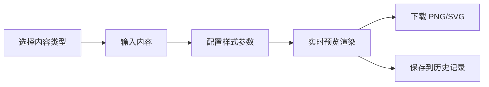
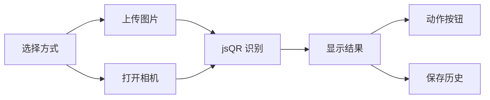
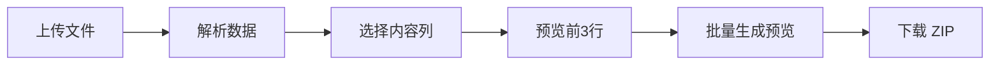

## 1. 产品概述

QR Code Studio 是一款功能全面的在线 QR 码和条码工具，支持生成、解析、批量处理等多种场景。无需安装，浏览器即用，所有数据本地存储，保护用户隐私。

- 核心价值：一站式二维码/条码解决方案，覆盖生成、扫描、批量处理全场景
- 目标用户：营销人员、开发者、设计师、办公人群

## 2. 核心功能

### 2.1 功能模块

1. **QR 生成器**：支持 URL、文本、WiFi、vCard、Email、电话、短信等多种内容类型
2. **QR 解析器**：图片上传识别、相机实时扫描
3. **批量生成**：CSV/Excel 导入，批量下载 ZIP
4. **条码生成器**：Code128、EAN13、UPC、CODE39、ITF
5. **WiFi 二维码**：专属 WiFi 配置生成页面
6. **分享与嵌入**：URL 深链分享、嵌入代码片段
7. **历史管理**：本地存储 20 条历史记录

### 2.2 页面详情

| 页面名称 | 模块名称 | 功能描述 |
|---------|---------|---------|
| QR 生成页 | 内容类型选择 | 切换 URL/文本/WiFi/vCard/Email/电话/短信 |
| QR 生成页 | 样式配置 | 尺寸、纠错等级、前景/背景色、渐变、圆角 dot |
| QR 生成页 | Logo 上传 | PNG 居中嵌入，纠错容限提示 |
| QR 生成页 | 渲染模式切换 | SVG / Canvas 可选 |
| QR 生成页 | 下载 | PNG / SVG 一键下载 |
| QR 解析页 | 图片上传 | 拖入/选择图片，jsQR 识别 |
| QR 解析页 | 多码识别 | 一张图多个 QR 逐一解析 |
| QR 解析页 | 相机扫描 | 实时扫描自动解析，动作按钮 |
| QR 解析页 | 历史记录 | 20 条历史，localStorage 存储 |
| 批量生成页 | 文件上传 | CSV/Excel 文件导入 |
| 批量生成页 | 列选择 | 选择内容列，预览前 3 行 |
| 批量生成页 | 批量预览 | 网格预览，跳过空行/错误行 |
| 批量生成页 | 批量下载 | ZIP 打包，命名规则 row1_{内容}.png |
| 条码生成页 | 码制选择 | Code128、EAN13、UPC、CODE39、ITF |
| 条码生成页 | 文字标签 | 可选显示编码文字 |
| WiFi 二维码页 | WiFi 配置 | SSID、安全类型、密码 |
| WiFi 二维码页 | 预览卡片 | SSID + 密码文字样式预览 |
| 分享面板 | 深链分享 | hash encode 保存参数 |
| 分享面板 | 嵌入代码 | `` 代码片段 |
| 历史管理页 | 历史列表 | 已生成记录列表 |
| 历史管理页 | 重新加载 | 点击历史记录恢复参数 |

## 3. 核心流程

### 3.1 QR 码生成流程

用户选择内容类型 → 输入内容 → 配置样式（尺寸/颜色/Logo等）→ 实时预览 → 下载 PNG/SVG → 保存到历史

### 3.2 QR 码解析流程

用户选择图片或打开相机 → 识别 QR 码 → 显示解析结果 → 提供动作按钮（打开/复制）→ 保存到历史

### 3.3 批量生成流程

上传 CSV/Excel → 选择内容列 → 预览前 3 行 → 批量生成网格预览 → 下载 ZIP

## 4. 用户界面设计

### 4.1 设计风格

- **整体风格**：深色科技风 + 霓虹渐变，现代工具类产品美学
- **主色调**：深紫蓝渐变（#1a1a2e → #16213e），霓虹青（#00d4ff）作为强调色
- **辅助色**：霓虹粉（#ff006e）、霓虹绿（#39ff14）用于状态提示
- **背景**：深色渐变 + 微妙网格纹理，玻璃拟态卡片
- **字体**：标题用 Space Grotesk，正文用 Inter（等宽字体用于数据展示）
- **按钮**：圆角 8px，悬停有发光效果，主按钮带霓虹边框
- **卡片**：半透明玻璃态，backdrop-filter 模糊，细边框

### 4.2 页面设计概览

| 页面名称 | 模块名称 | UI 元素 |
|---------|---------|---------|
| 顶部导航 | Logo + 菜单 | 左侧品牌标识，右侧功能导航，下划线指示当前页 |
| QR 生成页 | 双栏布局 | 左侧配置面板（分组折叠），右侧预览区（大尺寸展示） |
| QR 解析页 | 双栏布局 | 左侧操作区（上传/相机切换），右侧结果展示区 |
| 批量生成页 | 三步流程 | 上传 → 列选择 → 预览与下载，步骤指示器 |
| 条码生成页 | 单栏聚焦 | 输入框 + 码制选择 + 大尺寸预览 |
| WiFi 二维码页 | 卡片式 | 表单 + 手机样式预览卡 |
| 历史管理页 | 列表/网格 | 缩略图 + 内容摘要，点击重新加载 |
| 分享弹窗 | 模态框 | Tab 切换（链接/嵌入代码），一键复制 |

### 4.3 响应式

- 桌面端（>1024px）：双栏布局，左侧配置、右侧预览
- 平板（768-1024px）：上下布局，预览在上、配置在下
- 移动端（<768px）：单列布局，Tab 切换配置与预览
- 触摸优化：按钮最小 44px，手势支持

### 4.4 动效与交互

- 页面切换：淡入 + 轻微上移动画
- QR 预览：配置变化时平滑过渡
- 按钮悬停：霓虹发光效果，scale 微放大
- 相机扫描：扫描线动画，识别成功振动反馈
- 历史记录：悬浮放大效果
