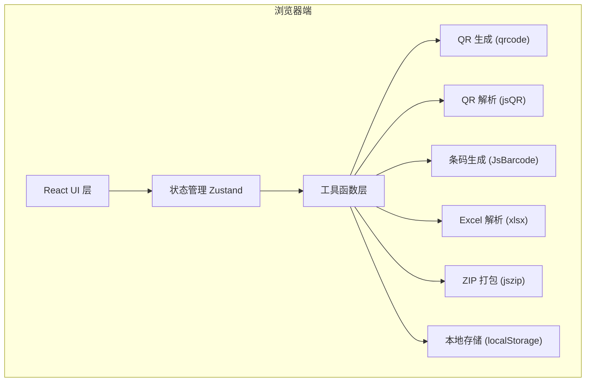

## 1. 架构设计

纯前端应用，所有功能在浏览器端完成，无需后端服务。数据存储在 localStorage 中。



## 2. 技术描述

- **前端框架**：React 18 + TypeScript
- **构建工具**：Vite 5
- **样式方案**：Tailwind CSS 3
- **状态管理**：Zustand
- **路由**：React Router DOM 6
- **图标库**：Lucide React

### 核心依赖库

| 库名 | 用途 | 版本 |
|------|------|------|
| qrcode | QR 码生成（Canvas/SVG） | ^1.5.3 |
| jsqr | QR 码图像识别 | ^1.4.0 |
| jsbarcode | 条码生成 | ^3.11.6 |
| xlsx | Excel 文件解析 | ^0.18.5 |
| jszip | ZIP 文件打包 | ^3.10.1 |
| file-saver | 文件下载保存 | ^2.0.5 |
| @types/file-saver | file-saver 类型 | ^2.0.7 |
| lucide-react | 图标库 | ^0.400.0 |

## 3. 目录结构

```
src/
├── components/          # 公共组件
│   ├── Layout/         # 布局组件
│   ├── QrPreview/      # QR 预览组件
│   ├── ColorPicker/    # 颜色选择器
│   └── ShareModal/     # 分享弹窗
├── pages/              # 页面组件
│   ├── QrGenerate/     # QR 生成页
│   ├── QrScan/         # QR 解析页
│   ├── BatchGenerate/  # 批量生成页
│   ├── Barcode/        # 条码生成页
│   ├── WifiQr/         # WiFi 二维码页
│   └── History/        # 历史管理页
├── hooks/              # 自定义 Hooks
│   ├── useQrCode.ts    # QR 生成逻辑
│   ├── useQrScanner.ts # QR 扫描逻辑
│   └── useHistory.ts   # 历史记录管理
├── store/              # Zustand 状态
│   └── qrStore.ts      # QR 相关状态
├── utils/              # 工具函数
│   ├── qr.ts           # QR 生成工具
│   ├── barcode.ts      # 条码生成工具
│   ├── excel.ts        # Excel 解析工具
│   ├── zip.ts          # ZIP 打包工具
│   ├── storage.ts      # 本地存储工具
│   └── share.ts        # 分享深链工具
├── types/              # 类型定义
│   └── index.ts
├── App.tsx
├── main.tsx
└── index.css
```

## 4. 路由定义

| 路由路径 | 页面组件 | 说明 |
|---------|---------|------|
| / | QrGenerate | QR 码生成（首页） |
| /scan | QrScan | QR 码解析/扫描 |
| /batch | BatchGenerate | 批量生成 |
| /barcode | Barcode | 条码生成 |
| /wifi | WifiQr | WiFi 二维码 |
| /history | History | 历史管理 |

## 5. 数据模型

### 5.1 QR 生成配置

```typescript
interface QrConfig {
  type: 'url' | 'text' | 'wifi' | 'vcard' | 'email' | 'tel' | 'sms';
  content: string;
  size: number;           // 128-1024
  errorLevel: 'L' | 'M' | 'Q' | 'H';
  foregroundColor: string;
  backgroundColor: string;
  gradient: {
    enabled: boolean;
    type: 'linear' | 'radial';
    colors: string[];
    rotation?: number;
  };
  logo: {
    enabled: boolean;
    dataUrl: string;
    size: number;          // 百分比 10-30
  };
  roundedDots: boolean;
  renderMode: 'svg' | 'canvas';
}
```

### 5.2 历史记录

```typescript
interface HistoryItem {
  id: string;
  type: 'qr' | 'barcode' | 'wifi';
  config: QrConfig | BarcodeConfig | WifiConfig;
  preview: string;        // 缩略图 dataUrl
  content: string;        // 内容摘要
  createdAt: number;
}
```

### 5.3 条码配置

```typescript
interface BarcodeConfig {
  format: 'CODE128' | 'EAN13' | 'UPC' | 'CODE39' | 'ITF';
  content: string;
  width: number;
  height: number;
  displayValue: boolean;
  fontSize: number;
  margin: number;
  lineColor: string;
  backgroundColor: string;
}
```

## 6. 核心功能实现方案

### 6.1 QR 码生成
- 使用 `qrcode` 库生成基础 QR 码
- 渐变效果：Canvas 模式下使用渐变填充；SVG 模式下使用 `<linearGradient>` / `<radialGradient>`
- Logo 嵌入：Canvas 模式下 drawImage；SVG 模式下 `<image>` 标签
- 圆角 dot：自定义 dot 渲染，使用 arc 绘制圆形模块

### 6.2 QR 码解析
- 图片上传：FileReader 读取 → Image 对象 → Canvas 绘制 → jsQR 识别
- 多码识别：分区域扫描或使用 jsQR 的多码检测能力
- 相机扫描：`getUserMedia` 获取视频流 → requestAnimationFrame 逐帧识别

### 6.3 批量生成
- 文件上传：xlsx 库解析 Excel，原生解析 CSV
- 批量预览：虚拟滚动或分页展示
- ZIP 下载：jszip 打包，file-saver 触发下载

### 6.4 分享深链
- 将配置参数 JSON 序列化为 base64 编码
- 拼接到 URL hash 中
- 页面加载时检测 hash 并恢复参数

## 7. 性能优化

- QR 预览使用防抖（debounce）避免频繁重绘
- 大尺寸生成时使用 Web Worker（可选）
- 历史记录缩略图压缩存储
- 批量生成使用分片处理避免阻塞主线程
